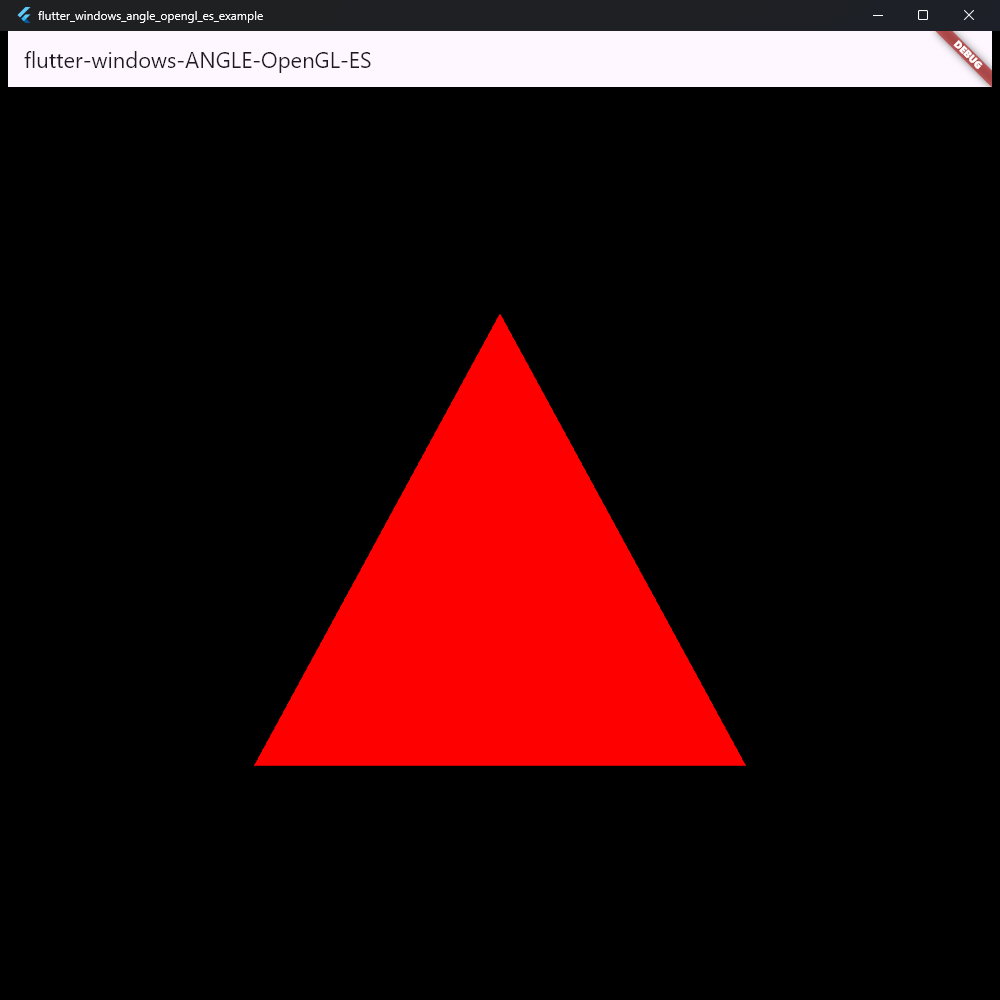

# flutter-windows-ANGLE-OpenGL-ES

OpenGL ES rendering in a Flutter Windows `Texture` widget using ANGLE.



## Runtime

The repository provides reproducible ANGLE development/runtime packages for
Windows x64 and ARM64. The runtime is built from ANGLE branch `chromium/7981`,
pinned to commit `2c5c60cd270d1596fa8abe06bd277983852f4b2b`.

Compiled backends:

- Direct3D 11;
- Desktop OpenGL;
- native OpenGL ES;
- Vulkan.

Direct3D 11 is used by the Flutter shared-texture example. The plugin targets
stock Flutter 3.44.8 stable and Dart `^3.12.0`.

## Flutter example

The example renders the ANGLE Hello Triangle into a D3D11 shared texture and
displays it with Flutter's `GpuSurfaceTexture`.

```cmd
cd example
flutter pub get
flutter run -d windows
```

## Build ANGLE

Requirements:

- Windows 11 x64;
- Visual Studio C++ tools, Git, CMake, Python, WinGet, and 7-Zip;
- Windows SDK `10.0.28000.0` or newer;
- enough disk space for the ANGLE checkout and x64/ARM64 release outputs.

The exact ANGLE, depot_tools, Chromium DEPS, Vulkan, and toolchain inputs are
stored in [config/angle.lock.json](config/angle.lock.json) and
[config/toolchain.lock.json](config/toolchain.lock.json).

Set up the pinned source checkout once:

```cmd
python scripts\windows\angle.py setup
```

Build and package x64:

```cmd
python scripts\windows\angle.py build x64
python scripts\windows\angle.py collect x64
python scripts\windows\angle.py verify x64
python scripts\windows\angle.py smoke build x64
python scripts\windows\angle.py smoke run x64
python scripts\windows\angle.py package x64
```

Build and package ARM64:

```cmd
python scripts\windows\angle.py build arm64
python scripts\windows\angle.py collect arm64
python scripts\windows\angle.py verify arm64
python scripts\windows\angle.py smoke build arm64
python scripts\windows\angle.py package arm64
python scripts\windows\angle.py checksums
python scripts\windows\angle.py validate-archives --require-checksums
```

CI performs the complete build and validation workflow in
[build-angle.yml](.github/workflows/build-angle.yml), including native ARM64
smoke tests. Local build output and reports are stored under `.angle-work`.

## Release artifacts

Release `v1.1.0` produces:

- `ANGLE-2c5c60cd270d-windows-x64.7z`;
- `ANGLE-2c5c60cd270d-windows-arm64.7z`;
- `SHA256SUMS`.

Archive names use the first 12 characters of the pinned ANGLE commit. Each
archive contains:

```text
include/EGL/**
include/GLES2/**
include/GLES3/**
include/KHR/**
lib/libEGL.dll
lib/libGLESv2.dll
lib/libEGL.dll.lib
lib/libGLESv2.dll.lib
lib/vulkan-1.dll
lib/d3dcompiler_47.dll
LICENSES/**
manifest.json
```

All archive timestamps are derived from the pinned ANGLE commit. Repeating the
build and packaging workflow with unchanged inputs produces deterministic
outputs.

Verify downloaded archives with:

```powershell
Get-FileHash -Algorithm SHA256 dist\*.7z
python scripts\windows\angle.py validate-archives --require-checksums
```

## Validation

The build verifies PE/COFF architecture, runtime imports, headers, import
libraries, archive layout, checksums, and reproducibility metadata. The native
smoke test creates an EGL pbuffer and OpenGL ES context, renders a triangle,
and validates pixel readback for every compiled backend.

| Backend | EGL selector |
| --- | --- |
| Direct3D 11 | `EGL_PLATFORM_ANGLE_TYPE_D3D11_ANGLE` |
| Desktop OpenGL | `EGL_PLATFORM_ANGLE_TYPE_OPENGL_ANGLE` |
| Native OpenGL ES | `EGL_PLATFORM_ANGLE_TYPE_OPENGLES_ANGLE` |
| Vulkan | `EGL_PLATFORM_ANGLE_TYPE_VULKAN_ANGLE` |

## CMake integration

Extract the matching archive into `${CMAKE_BINARY_DIR}/ANGLE`, add
`ANGLE/include` to the include path, and link:

```text
ANGLE/lib/libEGL.dll.lib
ANGLE/lib/libGLESv2.dll.lib
```

Bundle the four runtime DLLs from `ANGLE/lib` next to the Windows executable.

## Acknowledgements

- [@jnschulze](https://github.com/jnschulze) for Direct3D texture interop.
- [ANGLE HelloTriangle](https://github.com/google/angle/blob/chromium/7981/samples/hello_triangle/HelloTriangle.cpp).
