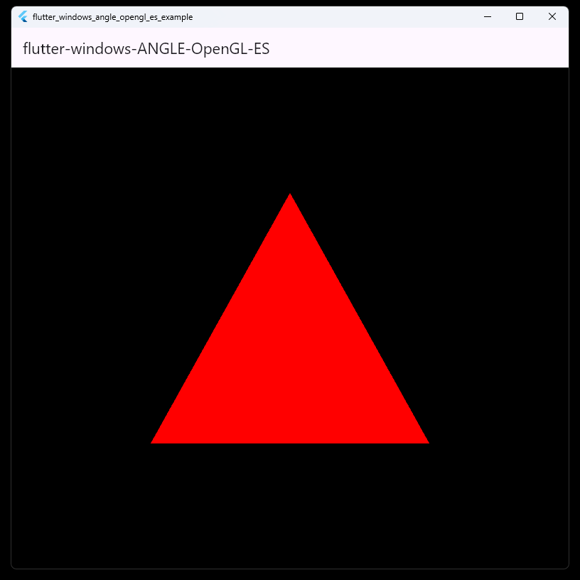

# flutter-windows-ANGLE-OpenGL-ES

Prebuilt universal ANGLE Windows runtimes for x64 and ARM64, plus a Flutter
plugin that renders OpenGL ES in a `Texture` through a D3D11 shared handle.



## Runtime

The bundled ANGLE source is pinned to branch `chromium/8059`, commit
`d10b3bd2324e42216ccd80c2bc82535d07cc674e`. Windows x64 and ARM64 packages
include D3D11 with feature-level 9_3 compatibility and WARP fallback, desktop
OpenGL, native OpenGL ES, Vulkan, and SwiftShader. D3D9 is disabled.

Use the latest stable Flutter `3.47.x` patch and its bundled Dart `3.13.x` SDK.
The locally tested versions are recorded in the release build log. CI uses the
bundled Dart SDK and bootstraps its native ARM64 variant on the ARM64 runner.

## Example

```cmd
cd example
flutter pub get
flutter run -d windows
```

The example renders a GLES2 triangle into an ANGLE D3D11 texture and displays
it with Flutter's `GpuSurfaceTexture`.

## Build

Install Visual Studio C++ tools, the latest Windows SDK `10.0.28000.x`, Git,
Python 3.14.7, and 7-Zip. The exact ANGLE and depot_tools revisions are in
[config/angle.lock.json](config/angle.lock.json). ANGLE's own `DEPS` determines
its transitive dependencies.

```cmd
python scripts\windows\angle.py setup
python scripts\windows\angle.py build x64
python scripts\windows\angle.py verify x64 --install
python scripts\windows\angle.py smoke x64
cd example
flutter pub get
flutter analyze
flutter build windows --release
cd ..
python scripts\windows\angle.py package x64
```

Repeat `build`, `verify`, `smoke`, and `package` for `arm64` on an ARM64 Windows
host. The x64 host can cross-build ARM64 binaries, while the native backend
smoke matrix must run on ARM64. CI follows this sequence for both architectures.

## Release files

- `ANGLE-d10b3bd2324e-windows-x64.7z`
- `ANGLE-d10b3bd2324e-windows-arm64.7z`
- `SHA256SUMS`

The short SHA in archive names is computed from the full ANGLE commit. Packages
contain ANGLE EGL/GLES headers, import libraries, the D3D compiler, EGL/GLES,
Vulkan loader and SwiftShader runtime files, their licenses, and a small
manifest. Distributed DLL and import-library timestamps use the repository HEAD
committer timestamp recorded as `repository_commit_timestamp`; the manifest also
records `repository_commit`. Verify each archive against its accompanying
`SHA256SUMS`.

## Acknowledgements

- [@jnschulze](https://github.com/jnschulze) for Direct3D texture interop.
- [media-kit](https://github.com/media-kit/media-kit) for the original Windows shared-texture implementation.
